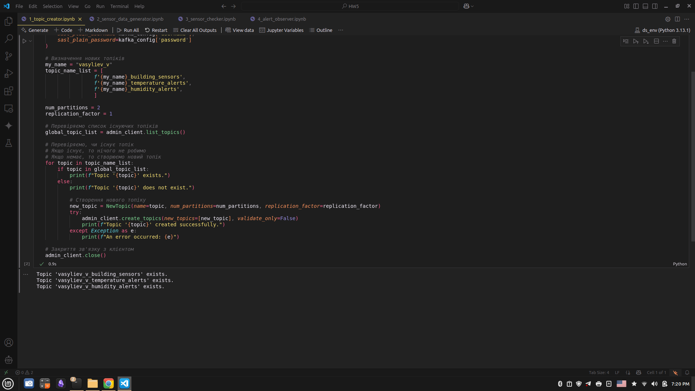
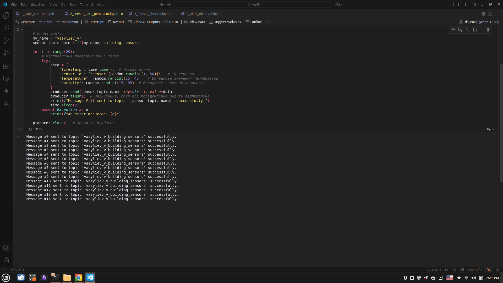
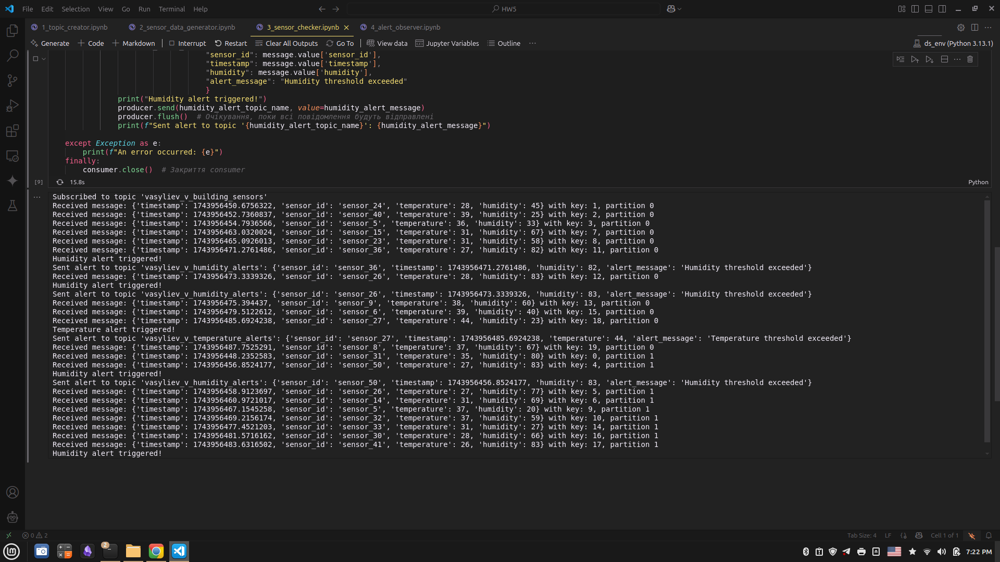
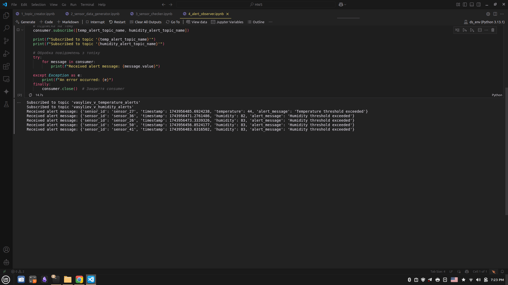

# 1. Створення топіків

P.S. Не знаю як видалити вже створенні топікі, томі демонструю факт створення та код для створення.

# 2. Генерація повідомленнь від сенсорів та відправлення до топіка

# 3. Отримання всіх повідомлень та фільтрація алертів

# 4. Отримання повідомлень з алертами

